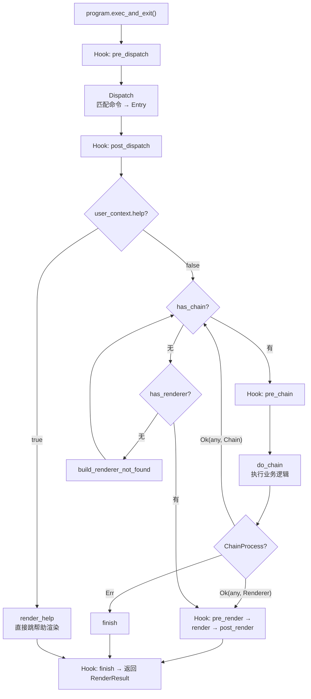
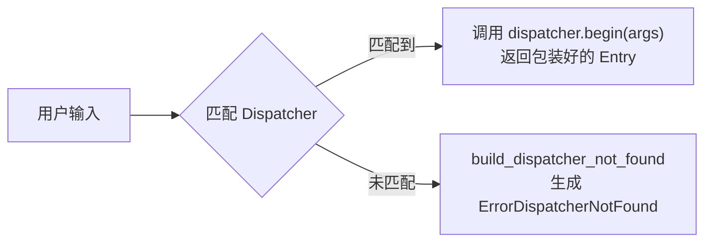
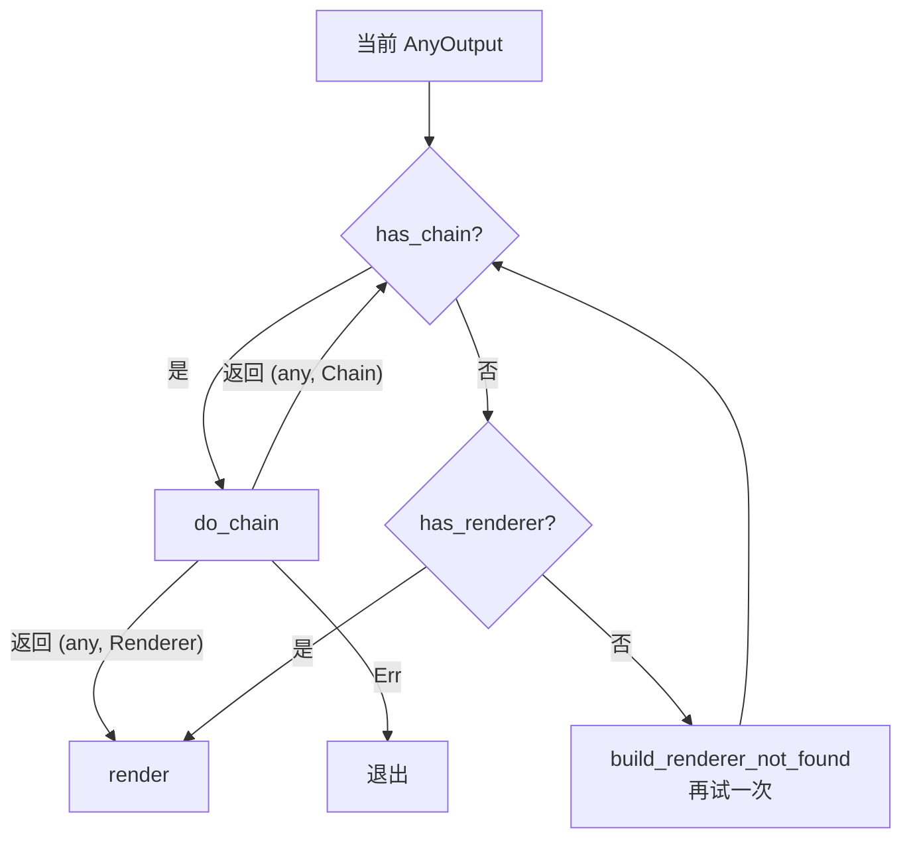

<h1 align="center">基础管线</h1>
<p align="center">
    Mingling 的核心执行流程
</p>

Mingling 把命令的处理拆成三个独立的阶段：Dispatcher → Chain → Renderer。这篇讲实际的执行逻辑——从用户输入到最终输出，每一步发生了什么。

## 完整流程


 
## 阶段详解

### 1. 分发

`exec_with_args` 首先调用 `dispatch_args_dynamic` 或 `dispatch_args_trie`（取决于是否启用 `dispatch_tree` 特性），将用户输入的参数与注册的 Dispatcher 匹配。

匹配规则是按空格分割的**前缀匹配**——优先匹配最长的那个。例如注册了 `remote.add` 和 `remote`，输入 `remote add origin` 会匹配 `remote.add`。


 
匹配成功后调用 `dispatcher.begin(args)`，返回 `ChainProcess::Ok((AnyOutput, _))`，即包装好用户输入参数的 Entry 类型。

如果没有匹配到任何 Dispatcher，则生成 `ErrorDispatcherNotFound`（包裹完整的输入参数），后续可以被 Renderer 处理显示 "Command not found"。

### 2. Help 短路

在进入主循环前，检查 `program.user_context.help`。如果为 `true`（由 `BasicProgramSetup` 中的 `HelpFlagSetup` 在解析到 `--help` 时设置），直接调用 `render_help` 跳过整个管线。

### 3. Chain 主循环

这是核心调度逻辑。每次循环检查当前的 `AnyOutput`：

1. **有 Chain 能处理** → 执行 `C::do_chain(current)`
   - 返回 `(AnyOutput, Renderer)` → 退出循环，进入渲染
   - 返回 `(AnyOutput, Chain)` → 继续循环，把结果交给下一个 Chain
   - 返回 `Err` → 终止程序

2. **没有 Chain，但有 Renderer** → 直接渲染

3. **两者都没有** → 生成 `renderer_not_found`，再循环一次（因为刚生成的这个类型可能有 Renderer）


 
### 4. Render

渲染阶段调用 `C::render(any, &mut render_result)`，根据 `member_id` 找到对应的 `#[renderer]` 函数，将结果写入 `RenderResult`。如果启用了 `structural_renderer`，还会根据 `program.structural_renderer_name` 将结果序列化为 JSON/YAML 等格式。

### 5. 退出

设置 `exit_code`，触发 `finish` hook，返回 `RenderResult`。

> [!TIP]
> 这套运行时调度代码由 `gen_program!()` 生成的枚举和 `ProgramCollect` 实现来驱动。
>
> 编译期只生成了类型到 Chain / Renderer / Help / Completion 的映射关系，实际的匹配和路由都是在运行时完成的。

## 这和直接函数调用的区别

这套管线可以避免你写出如下的代码：

```rust
@@@ struct Config;
@@@ impl Config { fn read() -> Self { Config } }
@@@ fn main() {
@@@ let json = true;
// 读取配置
let mut config = Config::read();
 
// 执行操作
let Ok(result) = operation(&mut config) else {
    panic!("错误处理");
};
 
// 渲染结果
if json {
    print_json();
} else {
    println!("成功！");
}
@@@ }
@@@ fn operation(config: &mut Config) -> Result<(),()> { Ok(()) }
@@@ fn print_json() {}
```
 
Mingling 的管线把 **命令匹配**、**业务逻辑**、**输出展示** 拆成三个独立的位置，每个位置只负责一件事。

更重要的是，管线经过 hook 和 `AnyOutput` 机制，允许横切关注点（日志、鉴权、退出码）无侵入地插入，不会污染你的业务代码。

<p align="center" style="font-size: 0.85em; color: gray;">
    Written by @Weicao-CatilGrass
</p>
