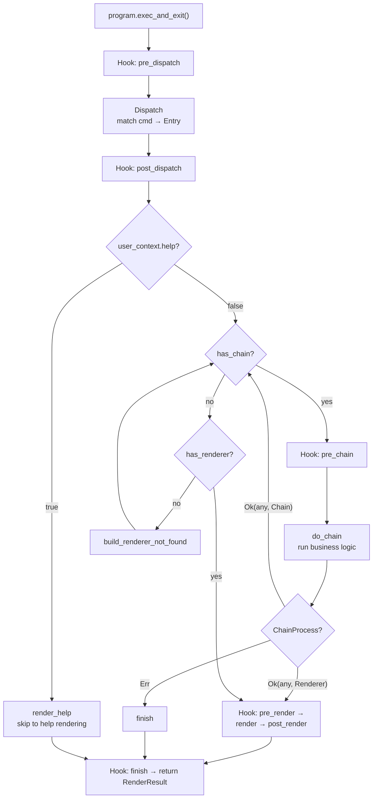
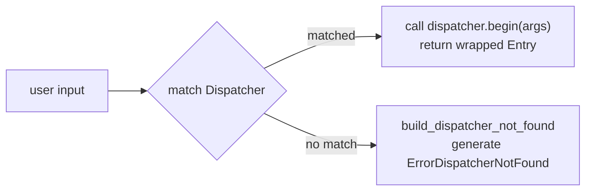
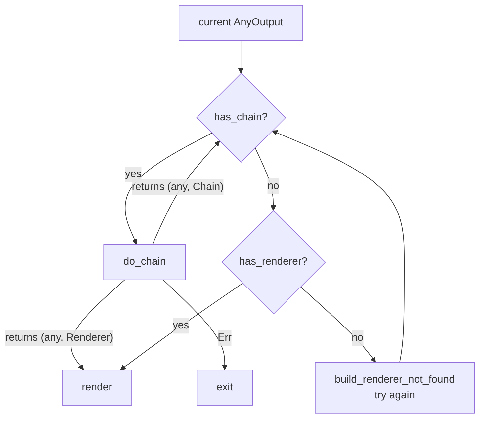

<h1 align="center">The Pipeline</h1>
<p align="center">
    How Mingling executes commands, step by step
</p>

Mingling splits command handling into three independent phases: Dispatcher → Chain → Renderer. This doc covers the actual execution logic — what happens at each step from user input to final output.

## Full Flow


 
## Phase Breakdown

### 1. Dispatch

`exec_with_args` first calls `dispatch_args_dynamic` or `dispatch_args_trie` (depending on whether the `dispatch_tree` feature is enabled), matching user input against registered Dispatchers.

The matching rule is **prefix matching** on space-separated tokens — the longest match wins. For example, if both `remote.add` and `remote` are registered, input `remote add origin` will match `remote.add`.


 
On a match, `dispatcher.begin(args)` is called, returning `ChainProcess::Ok((AnyOutput, _))` — the Entry type wrapping the user's input params.

If no Dispatcher matches, `ErrorDispatcherNotFound` is generated (wrapping the full input), which a Renderer can later handle to display "Command not found".

### 2. Help Shortcut

Before entering the main loop, `program.user_context.help` is checked. If `true` (set by `HelpFlagSetup` in `BasicProgramSetup` when `--help` is parsed), `render_help` is called directly, skipping the entire pipeline.

### 3. Chain Main Loop

This is the core scheduling logic. Each iteration checks the current `AnyOutput`:

1. **Has a Chain** → execute `C::do_chain(current)`
   - Returns `(AnyOutput, Renderer)` → exit loop, go to rendering
   - Returns `(AnyOutput, Chain)` → continue loop, pass result to next Chain
   - Returns `Err` → terminate

2. **No Chain, but has a Renderer** → render directly

3. **Neither** → generate `renderer_not_found`, then loop again (the newly generated type might have a Renderer)


 
### 4. Render

The rendering phase calls `C::render(any, &mut render_result)`, which finds the matching `#[renderer]` function via `member_id` and writes the result into `RenderResult`. If `structural_renderer` is enabled, the result is also serialized to JSON/YAML (etc.) based on `program.structural_renderer_name`.

### 5. Exit

Sets `exit_code`, triggers the `finish` hook, and returns `RenderResult`.

> [!TIP]
> This runtime dispatch code is driven by the enums generated by `gen_program!()` and the `ProgramCollect` implementation.
>
> At compile time only the type-to-Chain / Renderer / Help / Completion mapping is generated; actual matching and routing happens at runtime.

## How This Is Different from Direct Function Calls

This pipeline helps avoid writing code like this:

```rust
@@@ struct Config;
@@@ impl Config { fn read() -> Self { Config } }
@@@ fn main() {
@@@ let json = true;
// read config
let mut config = Config::read();
 
// run operation
let Ok(result) = operation(&mut config) else {
    panic!("error handling");
};
 
// render result
if json {
    print_json();
} else {
    println!("success!");
}
@@@ }
@@@ fn operation(config: &mut Config) -> Result<(),()> { Ok(()) }
@@@ fn print_json() {}
```
 
Mingling's pipeline separates **cmd matching**, **business logic**, and **output rendering** into three independent slots, each responsible for one thing.

More importantly, through hooks and the `AnyOutput` mechanism, the pipeline lets cross-cutting concerns (logging, auth, exit codes) be inserted non-invasively — no pollution of your business code.

<p align="center" style="font-size: 0.85em; color: gray;">
    Written by @Weicao-CatilGrass
</p>
